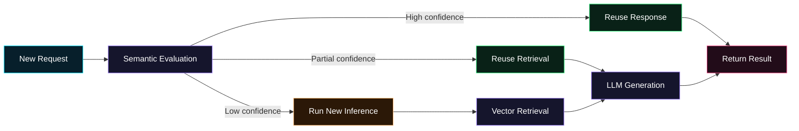
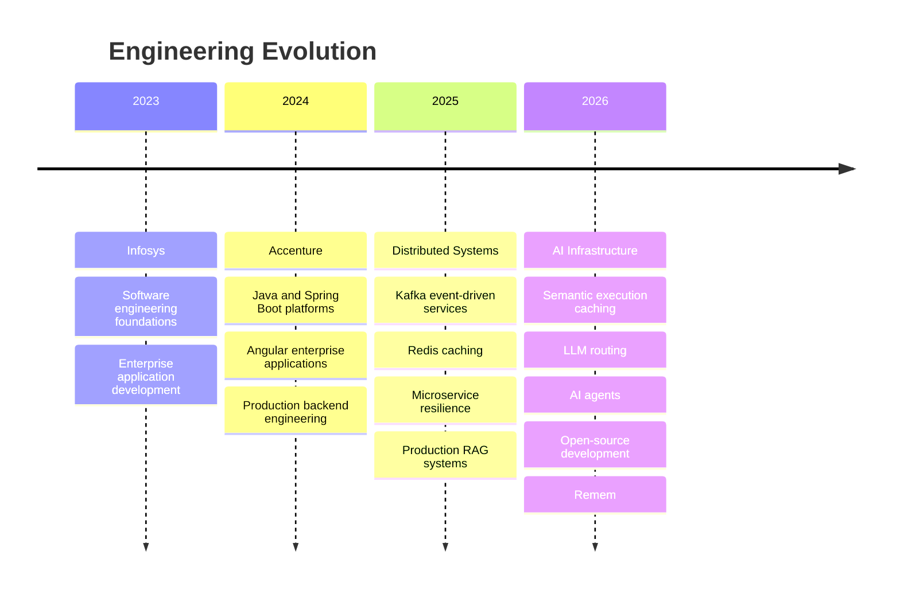
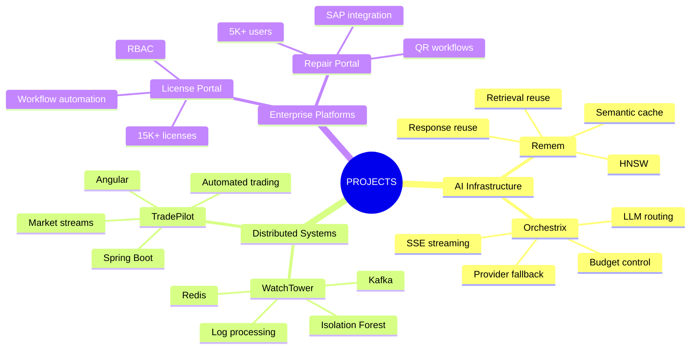
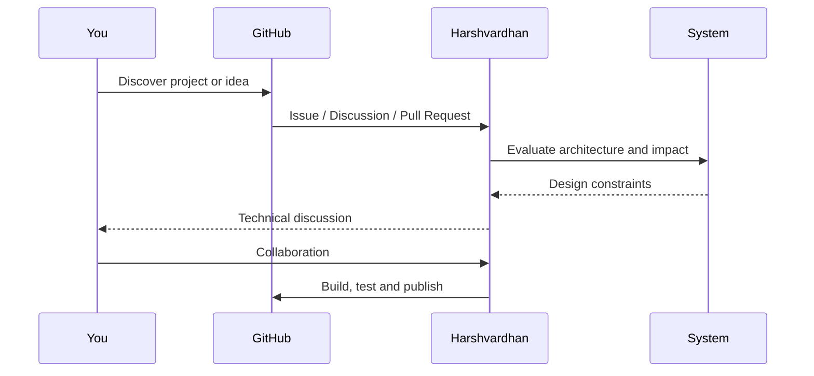

<div align="center">


<br/>


<br/>

[](https://hrsvd.dev)
[](https://github.com/hrsvd)
[](https://www.linkedin.com/in/harshvardhansingh-in/)
[](mailto:harshvardhan1483@gmail.com)

<br/>

```text
┌──────────────────────────────────────────────────────────────────────────┐
│  SUBJECT       HARSHVARDHAN SINGH                                        │
│  CLASS         AI INFRASTRUCTURE ENGINEER                                │
│  SPECIALITY    LLM SYSTEMS · SEMANTIC MEMORY · DISTRIBUTED BACKENDS      │
│  CURRENT MODE  BUILDING SYSTEMS THAT THINK BEFORE THEY COMPUTE           │
│  STATUS        ● ONLINE                                                   │
└──────────────────────────────────────────────────────────────────────────┘
```

</div>

---

## `01 // NEURAL KNOWLEDGE UNIVERSE`

<div align="center">

> **Do not read this profile linearly. Traverse it like a knowledge graph.**

```mermaid
flowchart TB

    CORE((("🧠\nHARSHVARDHAN\nSINGH")))

    AI(("◉\nAI\nINFRA"))
    BACKEND(("◉\nBACKEND\nSYSTEMS"))
    OSS(("◉\nOPEN\nSOURCE"))
    RESEARCH(("◉\nRESEARCH"))
    EXPERIENCE(("◉\nEXPERIENCE"))
    WRITING(("◉\nTECHNICAL\nWRITING"))

    CORE === AI
    CORE === BACKEND
    CORE === OSS
    CORE === RESEARCH
    CORE === EXPERIENCE
    CORE === WRITING

    AI --- RAG["RAG Systems"]
    AI --- AGENTS["AI Agents"]
    AI --- MEMORY["Semantic Memory"]
    AI --- ROUTING["LLM Routing"]
    AI --- VECTOR["Vector Retrieval"]

    BACKEND --- JAVA["Java 17"]
    BACKEND --- SPRING["Spring Boot"]
    BACKEND --- PYTHON["Python"]
    BACKEND --- FASTAPI["FastAPI"]
    BACKEND --- EVENTS["Kafka"]
    BACKEND --- CACHE["Redis"]

    OSS --- REMEM["Remem"]
    OSS --- PYPI["PyPI"]
    OSS --- GH["GitHub"]
    OSS --- CONTRIBUTORS["Contributors"]

    RESEARCH --- PAPERS["AI Systems Papers"]
    RESEARCH --- ZENODO["Zenodo"]
    RESEARCH --- EVALUATION["Retrieval Evaluation"]
    RESEARCH --- ANOMALY["Anomaly Detection"]

    EXPERIENCE --- ACCENTURE["Accenture"]
    EXPERIENCE --- JSW["JSW Platforms"]
    EXPERIENCE --- INFOSYS["Infosys"]
    EXPERIENCE --- PRODUCTION["Production Systems"]

    WRITING --- MEDIUM["Medium"]
    WRITING --- HASHNODE["Hashnode"]
    WRITING --- DEVTO["DEV Community"]
    WRITING --- AINFRA["AI Infrastructure"]

    REMEM --- RESPONSE["Response Reuse"]
    REMEM --- RETRIEVAL["Retrieval Reuse"]
    REMEM --- EXECUTION["Fresh Execution"]
    REMEM --- HNSW["HNSW Search"]

    ACCENTURE --- LICENSE["License Platform"]
    ACCENTURE --- REPAIR["Repair Platform"]
    ACCENTURE --- ENTERPRISE["Enterprise AI"]

    classDef core fill:#050816,stroke:#7DF9FF,stroke-width:5px,color:#ffffff;
    classDef primary fill:#10142c,stroke:#ff4ecd,stroke-width:3px,color:#ffffff;
    classDef ai fill:#071f2b,stroke:#00e5ff,stroke-width:2px,color:#dfffff;
    classDef backend fill:#15152c,stroke:#9d7dff,stroke-width:2px,color:#ffffff;
    classDef oss fill:#092117,stroke:#39ff88,stroke-width:2px,color:#eafff1;
    classDef research fill:#2b1807,stroke:#ffb86c,stroke-width:2px,color:#fff5df;
    classDef experience fill:#220c19,stroke:#ff4d8d,stroke-width:2px,color:#ffe9f2;
    classDef writing fill:#071d28,stroke:#4da6ff,stroke-width:2px,color:#e8f5ff;
    classDef leaf fill:#0d1117,stroke:#59636e,stroke-width:1px,color:#c9d1d9;

    class CORE core;
    class AI,BACKEND,OSS,RESEARCH,EXPERIENCE,WRITING primary;
    class RAG,AGENTS,MEMORY,ROUTING,VECTOR ai;
    class JAVA,SPRING,PYTHON,FASTAPI,EVENTS,CACHE backend;
    class REMEM,PYPI,GH,CONTRIBUTORS,RESPONSE,RETRIEVAL,EXECUTION,HNSW oss;
    class PAPERS,ZENODO,EVALUATION,ANOMALY research;
    class ACCENTURE,JSW,INFOSYS,PRODUCTION,LICENSE,REPAIR,ENTERPRISE experience;
    class MEDIUM,HASHNODE,DEVTO,AINFRA writing;
```

</div>



---

## `02 // CURRENT EXECUTION CONTEXT`

```yaml
identity:
  name: Harshvardhan Singh
  role:
    - AI Infrastructure Engineer
    - Backend Engineer
    - Open Source Builder

current_focus:
  - semantic execution caching
  - production RAG systems
  - AI agent infrastructure
  - explainable LLM routing
  - high-performance backend systems

engineering_principles:
  - measure before optimizing
  - retrieve before generating
  - reuse before recomputing
  - explain every autonomous decision
  - design for failure before scale

mission: >
  Build infrastructure that lets intelligent systems
  remember previous work, make explainable decisions,
  and scale without repeating unnecessary computation.
```

---

## `03 // FEATURED INTELLIGENCE NODE`

<table>
<tr>
<td width="60%" valign="top">

### 🧠 [REMEM](https://github.com/hrsvd/remem)

> **Redis remembers keys. Remem remembers intelligence.**

Remem is an AI-native **semantic execution cache** for RAG pipelines, AI agents and LLM applications.

Instead of treating every request as completely new, Remem evaluates whether an AI system should reuse previous work or execute the pipeline again.



</td>
<td width="40%" valign="top">

### `REMEM.RUNTIME`

```text
┌──────────────────────────────┐
│ EXECUTION POLICY             │
├──────────────────────────────┤
│ RESPONSE REUSE       ACTIVE  │
│ RETRIEVAL REUSE      ACTIVE  │
│ FRESH INFERENCE      ACTIVE  │
│ EXACT SEARCH         ACTIVE  │
│ HNSW SEARCH          ACTIVE  │
│ POLICY FILTERS       ACTIVE  │
│ METRICS              ACTIVE  │
└──────────────────────────────┘
```

### Core capabilities

* Semantic response reuse
* Retrieval-context reuse
* Exact cosine search
* HNSW approximate search
* Namespace isolation
* Model-aware policies
* Prompt-version filtering
* Knowledge-base versioning
* Explainable reuse decisions
* Runtime metrics

<br/>

[](https://github.com/hrsvd/remem)

[](https://pypi.org/project/remem-ai/)

[](https://github.com/hrsvd/remem/stargazers)

</td>
</tr>
</table>

<div align="center">

<a href="https://github.com/hrsvd/remem">

</a>

</div>

---

## `04 // PRODUCTION EXPERIENCE MATRIX`



<table>
<tr>
<td width="50%" valign="top">

### `ACCENTURE // JSW`

```text
SYSTEM: LICENSE MANAGEMENT PLATFORM

Scale                  15,000+ licenses
Previous operation     ~15 minutes
Optimized operation    <1 minute
Core systems           Spring Boot · Angular
Security               JWT · RBAC
State                   PRODUCTION
```

</td>
<td width="50%" valign="top">

### `ENTERPRISE REPAIR PLATFORM`

```text
SYSTEM: REPAIR WORKFLOW

Users                  5,000+
Previous resolution    ~28 days
Optimized resolution   ~7 days
Integrations           SAP · QR workflows
Architecture           Enterprise services
State                   PRODUCTION
```

</td>
</tr>

<tr>
<td width="50%" valign="top">

### `PERFORMANCE ENGINEERING`

```text
API latency             450 ms → 250 ms
Frontend loading        5 sec → 2 sec
Methods                 Redis · SQL optimization
Delivery                CI/CD · GitHub Actions
State                   OPTIMIZED
```

</td>
<td width="50%" valign="top">

### `AI SYSTEMS`

```text
Production RAG          IMPLEMENTED
Database-aware AI       IMPLEMENTED
LLM integration         IMPLEMENTED
Agentic workflows       EXPLORING
Semantic reuse          BUILDING
State                   EVOLVING
```

</td>
</tr>
</table>

---

## `05 // ENGINEERING CONSTELLATIONS`

<table>
<tr>
<td width="33%" valign="top">

### `AI.INFRA`


</td>
<td width="33%" valign="top">

### `BACKEND.CORE`


</td>
<td width="33%" valign="top">

### `DISTRIBUTED.RUNTIME`


</td>
</tr>
</table>

<div align="center">


</div>

---

## `06 // PROJECT STAR SYSTEM`



<table>
<tr>
<td width="50%" valign="top">

### ⚡ Orchestrix

An explainable multi-provider LLM router with:

* Model and provider scoring
* Low, mid and high routing tiers
* Automatic fallback chains
* Rate and budget controls
* Streaming responses
* Decision explanations

`Spring Boot` `LLM Routing` `SSE` `MySQL`

</td>
<td width="50%" valign="top">

### 🛰 WatchTower

An event-driven anomaly detection system with:

* Distributed log producers
* Kafka ingestion
* Isolation Forest inference
* Redis anomaly storage
* Java and Python services
* Near-real-time detection

`Kafka` `Spring Boot` `Python` `Redis`

</td>
</tr>

<tr>
<td width="50%" valign="top">

### 📈 TradePilot

A full-stack automated market-analysis and trading platform with:

* Live market streams
* Technical indicators
* Automated execution
* Secure APIs
* Persistent trade history
* Interactive frontend

`Spring Boot` `Angular` `WebSocket` `PostgreSQL`

</td>
<td width="50%" valign="top">

### 📊 StockSignalsAPI

A technical-analysis backend providing:

* SMA and EMA
* RSI
* MACD
* Bollinger Bands
* Multi-provider market data
* Cached calculations

`Java` `Spring Boot` `Caffeine` `REST`

</td>
</tr>
</table>

---

## `07 // RESEARCH TRANSMISSIONS`

```text
research/
├── production-ai-systems/
│   ├── retrieval-evaluation
│   ├── semantic-reuse
│   └── llm-infrastructure
│
├── anomaly-detection/
│   ├── distributed-log-processing
│   ├── isolation-forest
│   └── real-time-inference
│
└── current-questions/
    ├── when-is-ai-work-safe-to-reuse?
    ├── how-should-semantic-caches-explain-decisions?
    └── how-can-rag-systems-avoid-repeated-computation?
```

<div align="center">

[](https://zenodo.org/records/21306898)
[](https://www.researchgate.net/profile/Harshvardhan-Kushwah)

</div>

---

## `08 // LIVE COMMIT TELEMETRY`

<div align="center">


</div>

<div align="center">


</div>

<div align="center">


</div>

<table>
<tr>
<td width="50%">


</td>
<td width="50%">


</td>
</tr>
</table>

<div align="center">


</div>

---

## `09 // CONTRIBUTION NEURAL TRAIL`

<div align="center">

> Every green cell is a recorded state transition in the engineering graph.

<picture>
  <source media="(prefers-color-scheme: dark)" srcset="https://raw.githubusercontent.com/hrsvd/hrsvd/output/github-contribution-grid-snake-dark.svg">
  <source media="(prefers-color-scheme: light)" srcset="https://raw.githubusercontent.com/hrsvd/hrsvd/output/github-contribution-grid-snake.svg">
  
</picture>

</div>

---

## `10 // OPEN-SOURCE SIGNAL`

<div align="center">


<br/><br/>


</div>

---

## `11 // TECHNICAL BROADCAST CHANNELS`

<table>
<tr>
<td width="33%" align="center">

### Medium

Story-driven explorations of AI infrastructure, backend engineering and production systems.

[](https://medium.com/@hrsvd)

</td>
<td width="33%" align="center">

### Hashnode

Architecture breakdowns, engineering lessons and practical system-design articles.

[](https://hashnode.com/@hrsvd)

</td>
<td width="33%" align="center">

### DEV Community

Developer-focused explanations, implementation details and open-source updates.

[](https://dev.to/hrsvd)

</td>
</tr>
</table>

---

## `12 // CURRENT RESEARCH QUESTIONS`

```diff
+ How much AI computation can be safely reused?

+ Can semantic caches make explainable decisions instead of relying
+ on a single similarity threshold?

+ How should AI agents remember tool executions across workflows?

+ Can retrieval results be reused without incorrectly reusing
+ the final generated answer?

+ What should the infrastructure layer between applications,
+ vector databases and LLM providers look like?

! These are not only questions.

! They are systems I am actively trying to build.
```

---

## `13 // COLLABORATION PROTOCOL`



I am interested in collaborating on:

* AI infrastructure and LLM runtime systems
* RAG evaluation and retrieval optimization
* Semantic caching and AI memory
* Explainable AI-agent architectures
* Java-based AI infrastructure
* Distributed backend systems
* Open-source developer tooling
* Applied AI systems research

<div align="center">

[](https://github.com/hrsvd/hrsvd/issues)
[](https://github.com/hrsvd?tab=repositories)
[](https://www.linkedin.com/in/harshvardhansingh-in/)

</div>

---

## `14 // SYSTEM PHILOSOPHY`

<div align="center">

```text
┌──────────────────────────────────────────────────────────────────────────┐
│                                                                          │
│              BUILD SYSTEMS THAT THINK BEFORE THEY COMPUTE.               │
│                                                                          │
│        ENGINEER INFRASTRUCTURE THAT SCALES IDEAS, NOT REQUESTS.           │
│                                                                          │
└──────────────────────────────────────────────────────────────────────────┘
```


<br/>

### `END OF STATIC PROFILE // KNOWLEDGE GRAPH CONTINUES TO EVOLVE`


</div>
